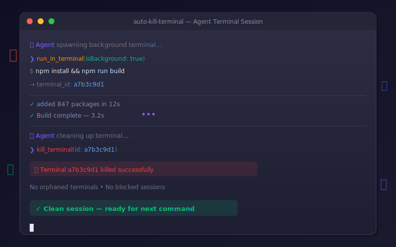

<p align="center">
  
</p>

# `auto-kill-terminal`

## Stop AI agents from leaving zombie terminals in your Codespace

AI coding agents (GitHub Copilot, Claude Code, Gemini, etc.) spawn terminal sessions to run commands — but they almost never clean up after themselves. In GitHub Codespaces, these orphaned terminals pile up invisibly, block future operations, and cause agents to hang or behave erratically.

This repo provides **copy-paste terminal management rules** for every major agent instruction file so your AI pair-programmer always cleans up after itself.

## The Problem

When AI agents use VS Code's `run_in_terminal` tool:

1. **Foreground terminals get reused** — stale shell sessions from previous commands persist and silently block new ones
2. **Background terminals are invisible** — in Codespaces, agent-spawned terminals aren't shown in the UI panel, so you don't notice them accumulating
3. **Agents retry in broken terminals** — instead of killing an unresponsive terminal and starting fresh, agents keep hammering the same dead session
4. **Terminal IDs are lost** — if the agent doesn't use `isBackground: true`, no terminal ID is returned, making cleanup impossible

The result: your Codespace gradually fills with ghost terminals until commands start timing out, the agent gets confused, and you waste tokens on retries.

## The Fix

Add terminal management rules to your agent instruction files. These five bullet points are all you need:

```markdown
## Terminal Management

- **Always use background terminals** (`isBackground: true`) for every command so a terminal ID is returned
- **Always kill the terminal** after the command completes, whether it succeeds or fails — never leave terminals open
- Do not reuse foreground shell sessions — stale sessions block future terminal operations in Codespaces
- In GitHub Codespaces, agent-spawned terminals may be hidden — they still work. Do not assume a terminal is broken if you cannot see it
- If a terminal appears unresponsive, kill it and create a new one rather than retrying in the same terminal
```

## Setup by Agent

### GitHub Copilot

Add to **copilot-instructions.md** in your repo root:

```markdown
## Terminal Management
- **Always use background terminals** (`isBackground: true`) for every command so a terminal ID is returned
- **Always kill the terminal** after the command completes, whether it succeeds or fails — never leave terminals open
- Do not reuse foreground shell sessions — stale sessions block future terminal operations in Codespaces
- In GitHub Codespaces, agent-spawned terminals may be hidden — they still work. Do not assume a terminal is broken if you cannot see it
- If a terminal appears unresponsive, kill it and create a new one rather than retrying in the same terminal
```

### Claude Code (CLAUDE.md)

Add to **CLAUDE.md** in your repo root:

```markdown
### Terminal Management

- **Always use background terminals** (`isBackground: true`) for every command so a terminal ID is returned
- **Always kill the terminal** after the command completes, whether it succeeds or fails — never leave terminals open
- Do not reuse foreground shell sessions — stale sessions block future terminal operations in Codespaces
- In GitHub Codespaces, agent-spawned terminals may be hidden — they still work. Do not assume a terminal is broken if you cannot see it
- If a terminal appears unresponsive, kill it and create a new one rather than retrying in the same terminal
```

### Gemini (GEMINI.md)

Add to **GEMINI.md** in your repo root:

```markdown
### Terminal Management

- **Always use background terminals** (`isBackground: true`) for every command so a terminal ID is returned
- **Always kill the terminal** after the command completes, whether it succeeds or fails — never leave terminals open
- Do not reuse foreground shell sessions — stale sessions block future terminal operations in Codespaces
- In GitHub Codespaces, agent-spawned terminals may be hidden — they still work. Do not assume a terminal is broken if you cannot see it
- If a terminal appears unresponsive, kill it and create a new one rather than retrying in the same terminal
```

### AGENTS.md (Multi-agent projects)

If you use an AGENTS.md for shared rules across multiple agents:

```markdown
### Terminal Management

- **Always use background terminals** (`isBackground: true`) for every command so a terminal ID is returned
- **Always kill the terminal** after the command completes, whether it succeeds or fails — never leave terminals open
- Do not reuse foreground shell sessions — stale sessions block future terminal operations in Codespaces
- In GitHub Codespaces, agent-spawned terminals may be hidden — they still work. Do not assume a terminal is broken if you cannot see it
- If a terminal appears unresponsive, kill it and create a new one rather than retrying in the same terminal
```

### Inline Agent Prompts (short form)

For task-specific agent prompts where space is tight, use the one-liner:

```markdown
**Terminal rules:** Always use `isBackground: true` for every terminal command, then kill the terminal after.
```

Or the two-line version:

```markdown
**Terminal management**: Always use background terminals (`isBackground: true`). Always kill terminals after use.
```

## Quick Start

Copy the files from this repo into your project:

```bash
# Clone
git clone https://github.com/YOUR_USER/auto-kill-terminal.git

# Copy the instruction snippets you need
cp auto-kill-terminal/.github/copilot-instructions.md your-project/.github/copilot-instructions.md
cp auto-kill-terminal/CLAUDE.md your-project/CLAUDE.md
```

Or just copy the 5 bullet points from The Fix into whatever agent instruction file you already have.

## Why Background Terminals?

| Approach | Terminal ID returned? | Can be killed programmatically? | Blocks shell? |
|---|---|---|---|
| `isBackground: false` | No | No | Yes |
| `isBackground: true` | Yes | Yes (`kill_terminal`) | No |

Background terminals return an ID that the agent can pass to `kill_terminal` (or `await_terminal` → `kill_terminal`). Without that ID, there's no way to clean up.

## Supported Environments

- GitHub Codespaces
- VS Code (local + remote)
- Any environment where AI agents use VS Code's terminal API

## License

MIT

